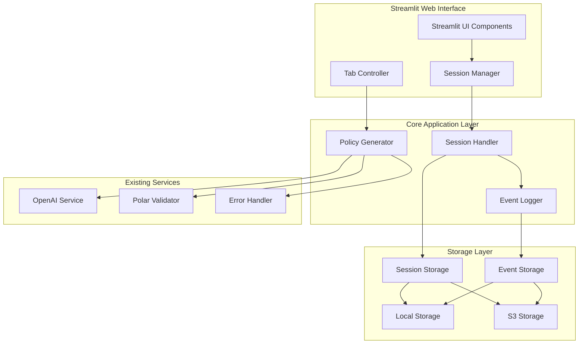
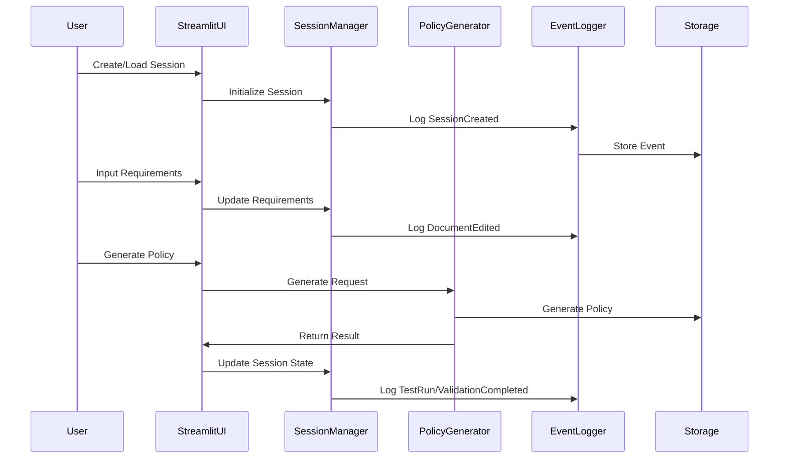

# Design Document

## Overview

The Polar Prompt Tester is a clean, purpose-built Streamlit web application designed specifically for interactive Polar policy generation and testing. The application focuses on providing an intuitive interface for prompt engineering experiments with session management, validation, and iterative improvement workflows.

The design adopts a streamlined architecture that reuses valuable components from the existing codebase (OpenAI integration, validation logic, storage patterns) while eliminating CLI-specific complexity and focusing entirely on the web-based user experience.

## Architecture

### High-Level Architecture



### Component Interaction Flow



## Components and Interfaces

### 1. Streamlit Web Interface

**StreamlitApp**
- Main application entry point
- Manages page routing and global state
- Handles session selection and creation UI

**SessionUI**
- Requirements input tab with text editor
- Generated code display tab with syntax highlighting
- Validation results tab with error display
- Notes tab for documentation
- Session history and metadata display

**TabController**
- Manages tab state and navigation
- Coordinates data flow between tabs
- Handles UI state persistence

### 2. Session Management Layer

**SessionManager**
```python
class SessionManager:
    def create_session(self, name: str) -> Session
    def load_session(self, session_id: str) -> Session
    def list_sessions(self) -> List[SessionMetadata]
    def save_session_state(self, session: Session) -> bool
    def delete_session(self, session_id: str) -> bool
```

**Session**
```python
@dataclass
class Session:
    id: str
    name: str
    created_at: datetime
    updated_at: datetime
    requirements_text: str
    generated_policies: List[GeneratedPolicy]
    validation_results: List[ValidationResult]
    notes: str
    metadata: Dict[str, Any]
```

**GeneratedPolicy**
```python
@dataclass
class GeneratedPolicy:
    id: str
    content: str
    generated_at: datetime
    model_used: str
    tokens_used: Optional[int]
    generation_time: float
    is_current: bool
```

### 3. Enhanced Storage Layer

**SessionStorage**
- Extends existing StorageBackend interface
- Implements session-specific operations
- Supports both local and S3 backends
- Handles session metadata and content separately

**EventStorage**
- Append-only event log implementation
- Stores events in chronological order
- Supports event replay for state reconstruction
- Implements S3-compatible interface

### 4. Event Logging System

**EventLogger**
```python
class EventLogger:
    def log_event(self, event: SessionEvent) -> bool
    def get_events(self, session_id: str) -> List[SessionEvent]
    def replay_session(self, session_id: str) -> Session
```

**SessionEvent**
```python
@dataclass
class SessionEvent:
    id: str
    session_id: str
    timestamp: datetime
    event_type: EventType
    user_id: str
    document_id: str
    version: int
    data: Dict[str, Any]
```

**EventType Enum**
- DocumentCreated
- DocumentEdited
- TestRun
- ValidationCompleted
- DocumentReworked
- SessionCreated
- SessionUpdated
- NotesAdded

### 5. Integration with Existing Components

The design reuses existing components with minimal modifications:

**PolicyGenerator** (existing)
- No changes required
- Used directly for code generation

**OpenAIService** (existing)
- No changes required
- Handles LLM interactions

**PolarValidator** (existing)
- No changes required
- Validates generated policies

**ErrorHandler** (existing)
- Enhanced to work with session context
- Maintains retry logic and error recovery

## Data Models

### Session Storage Schema

**Local Storage Structure:**
```
sessions/
├── {session_id}/
│   ├── metadata.json
│   ├── requirements.txt
│   ├── policies/
│   │   ├── {policy_id}.polar
│   │   └── {policy_id}_metadata.json
│   ├── validation_results/
│   │   └── {result_id}.json
│   └── notes.md
└── events/
    └── {session_id}_events.jsonl
```

**S3 Storage Structure:**
```
sessions/{session_id}/metadata.json
sessions/{session_id}/requirements.txt
sessions/{session_id}/policies/{policy_id}.polar
sessions/{session_id}/policies/{policy_id}_metadata.json
sessions/{session_id}/validation_results/{result_id}.json
sessions/{session_id}/notes.md
events/{session_id}_events.jsonl
```

### Event Log Schema

Each event stored as JSON Lines format:
```json
{
  "id": "evt_123",
  "session_id": "sess_456",
  "timestamp": "2025-01-17T10:30:00Z",
  "event_type": "TestRun",
  "user_id": "user_789",
  "document_id": "req_001",
  "version": 1,
  "data": {
    "model_used": "gpt-4",
    "tokens_used": 1500,
    "generation_time": 3.2,
    "validation_status": "success"
  }
}
```

## Error Handling

### Application-Level Error Handling

**StreamlitErrorHandler**
- Catches and displays user-friendly error messages
- Provides retry mechanisms for failed operations
- Logs errors for debugging while maintaining UX

**Session Recovery**
- Automatic session state recovery from events
- Graceful handling of corrupted session data
- Fallback to partial state reconstruction

**Storage Error Handling**
- Retry logic for transient storage failures
- Fallback between storage backends when possible
- Clear error messaging for storage configuration issues

### Validation Error Integration

- Reuses existing PolarValidator error handling
- Displays validation errors in dedicated UI tab
- Provides context-aware retry suggestions
- Maintains error history for analysis

## Testing Strategy

### Unit Testing

**Component Tests**
- SessionManager operations
- EventLogger functionality
- Storage backend implementations
- UI component behavior (using Streamlit testing utilities)

**Integration Tests**
- End-to-end session workflows
- Storage backend switching
- Event replay accuracy
- Policy generation with session context

### UI Testing

**Streamlit App Testing**
- Session creation and loading flows
- Tab navigation and state management
- Error display and recovery
- File upload and download functionality

**User Acceptance Testing**
- Complete workflow testing with real prompts
- Performance testing with large sessions
- Storage backend migration testing
- Multi-session management scenarios

### Performance Testing

**Session Management Performance**
- Large session loading times
- Event replay performance with many events
- Storage operation latency
- Memory usage with multiple active sessions

**Scalability Testing**
- Multiple concurrent sessions
- Large requirements documents
- Extensive generation history
- Storage capacity limits

## Simplified Architecture Approach

### Clean Slate Design

Since we're removing CLI compatibility and focusing purely on the Streamlit application, we can adopt a much cleaner architecture:

### 1. Streamlined Application Structure

```python
# New simplified structure:
app/
├── main.py              # Streamlit entry point
├── models/              # Data models and schemas
│   ├── session.py
│   ├── policy.py
│   └── events.py
├── services/            # Business logic services
│   ├── session_manager.py
│   ├── policy_generator.py
│   ├── openai_service.py
│   └── validator.py
├── storage/             # Storage implementations
│   ├── base.py
│   ├── local.py
│   └── s3.py
├── ui/                  # Streamlit UI components
│   ├── components/
│   ├── pages/
│   └── utils/
└── config/              # Configuration management
    └── settings.py
```

### 2. Reusable Components from Existing Codebase

**Keep and Adapt:**
- `OpenAIService` - Core LLM integration (minimal changes)
- `PolarValidator` - Validation logic (add async support)
- `StorageBackend` pattern - Clean up and simplify interface
- Configuration patterns - Streamline for web-only use

**Remove/Replace:**
- All CLI-specific code (`cli.py`, `main.py`)
- `PolicyRequest`/`PolicyResponse` - Replace with session-focused models
- Complex error handling - Simplify for web UI needs
- File-based configuration complexity

### 3. Core Service Simplification

```python
# Simplified PolicyGenerator for web use
class PolicyGenerator:
    def __init__(self, openai_service: OpenAIService, validator: PolarValidator):
        self.openai_service = openai_service
        self.validator = validator
    
    async def generate_policy(self, requirements: str, session_id: str) -> PolicyResult:
        # Clean, focused generation logic
        pass
```

### 4. Session-First Design

Everything built around sessions from the ground up:
- Session storage as primary data model
- Event logging integrated into session lifecycle
- UI state tied directly to session state
- No need for complex request/response patterns

### 5. Configuration Simplification

```yaml
# Streamlined config.yaml
app:
  name: "Polar Prompt Tester"
  port: 8501

openai:
  model: "gpt-4"
  temperature: 0.1

storage:
  type: "local"  # or "s3"
  path: "./sessions"

polar:
  cli_path: "oso-cloud"
```

This approach eliminates the complexity of maintaining backward compatibility while keeping the valuable core functionality. The result is a cleaner, more maintainable codebase focused specifically on the Streamlit use case.

## Configuration and Deployment

### Configuration Extensions

Extends existing `config.yaml` with new sections:

```yaml
streamlit:
  port: 8501
  host: "0.0.0.0"
  theme: "light"
  
sessions:
  max_sessions: 100
  auto_save_interval: 30
  session_timeout: 3600
  
events:
  batch_size: 100
  retention_days: 90
  compression: true
```

### Deployment Options

**Local Development**
- Single-user Streamlit application
- Local file storage
- Development configuration

**Team Deployment**
- Multi-user Streamlit application
- S3 storage backend
- Shared session access
- Authentication integration (future enhancement)

### Dependencies

New dependencies to add to `requirements.txt`:
```
streamlit>=1.28.0
streamlit-ace>=0.1.1
plotly>=5.17.0
```

## Security Considerations

### Data Protection
- Session data encryption at rest (S3 server-side encryption)
- Secure handling of API keys and credentials
- Input validation for all user-provided content

### Access Control
- Session isolation between users
- Secure storage key generation
- Rate limiting for API calls

### Storage Security
- S3 bucket policies for restricted access
- Local file permissions for development
- Audit logging for all storage operations